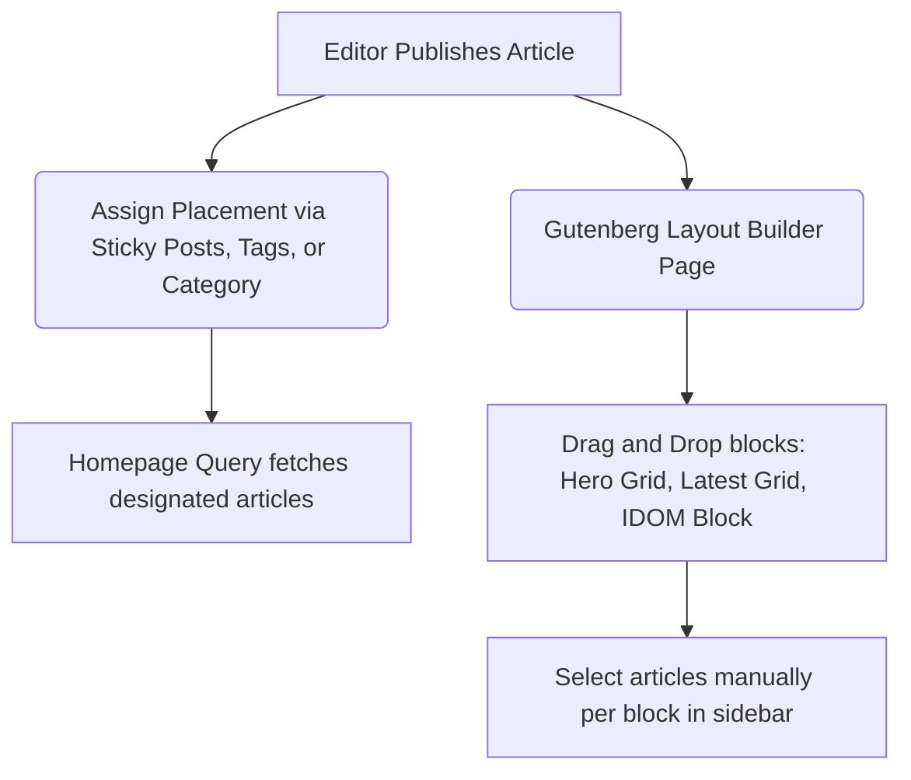

## 🏛️ Architectural Approaches

### Option A: Headless WordPress (WordPress API + React/Next.js Frontend)
In this model, WordPress functions purely as a headless Content Management System (CMS). Editors write and arrange content in the WordPress admin panel, and a React-based frontend (like Next.js) queries the WordPress REST API or WPGraphQL to build static HTML pages.

* **How it fits your prototype**: Your existing [app.jsx](file:///Users/sebastian/Documents/GitHub/marxistcom_draft/app.jsx) and [components.jsx](file:///Users/sebastian/Documents/GitHub/marxistcom_draft/components.jsx) files form the base of your frontend. Instead of static mock data arrays like `LATEST_ANALYSIS`, you fetch data from the WordPress API.
* **Why it scales**: You can deploy the frontend on global edge CDNs (such as Vercel, Netlify, or Cloudflare Pages) using **Incremental Static Regeneration (ISR)**. The server compiles pages to static HTML upon publish/update events. If 100,000 users visit the site simultaneously, they hit pre-rendered static files at the edge, requiring zero database queries or PHP executions.

### Option B: Native Gutenberg Theme (React-in-WordPress)
In this model, you build a native WordPress theme. WordPress uses React for its block editor (Gutenberg). You translate your React components into Gutenberg Blocks.

* **How it fits your prototype**: You bundle your design system tokens in [colors_and_type.css](file:///Users/sebastian/Documents/GitHub/marxistcom_draft/ds/colors_and_type.css) into a custom WordPress theme. Your JSX elements in [components.jsx](file:///Users/sebastian/Documents/GitHub/marxistcom_draft/components.jsx) are registered as native blocks using `@wordpress/blocks`.
* **Why it scales**: Standard WordPress requires robust server-side optimization: Redis object caching, database indexing, PHP OPcache, Varnish reverse proxy, and Cloudflare HTML caching at the edge to serve pages without overloading the server.

---

## ✍️ Editorial Workflow: How Editors Fill Content Boxes

To let editors easily highlight content and change styling treatments (e.g. "Taped" vs. "Offset" cards), you can implement **Advanced Custom Fields (ACF Pro)** combined with Gutenberg.

### 1. Managing Article Layouts & Metadata
Every article needs specific meta-fields to fill the visual components. Using ACF, you would define custom input fields in the WordPress editor:

| React Prop Name | Field Type in WordPress | Purpose |
| :--- | :--- | :--- |
| `kicker` | Text Field | The category prefix (e.g., `Middle East · History`) |
| `title` | Text Field (WP Title) | The main headline |
| `dek` / Excerpt | Textarea / Rich Text | Subtitle or introductory teaser text |
| `byline` | User Relationship / Text | Author name |
| `image` | Image Field | Featured artwork |
| `treatment` | Dropdown Select | Selects styling: `clean`, `offset`, `taped`, or `stamped` |

When an editor writes a story, they can toggle these options in the sidebar:
* **Style Variant Dropdown**: Choose "Taped" (renders the semi-transparent tape graphic overlay from [ArticleCard](file:///Users/sebastian/Documents/GitHub/marxistcom_draft/components.jsx#L147-L161)) or "Stamped" (renders the red rotated stamp overlay).
* **Font Choice**: Toggle "Serif" or "Sans" for the headline to match the dynamic layout adjustments in your current components.

---

### 2. Curating the Homepage Grid Layouts
Your homepage features a complex, highly curated grid: a 3-column [Hero](file:///Users/sebastian/Documents/GitHub/marxistcom_draft/app.jsx#L394) section, a [LatestAnalysisGrid](file:///Users/sebastian/Documents/GitHub/marxistcom_draft/app.jsx#L492), and a [TopicSplit](file:///Users/sebastian/Documents/GitHub/marxistcom_draft/app.jsx#L656) (e.g. comparing "Iran War" and "Palestine").

Editors can curate these areas dynamically using three main workflows:



#### Method A: Custom Gutenberg Layout Blocks (Flexible & Visual)
You build custom blocks representing the sections in [app.jsx](file:///Users/sebastian/Documents/GitHub/marxistcom_draft/app.jsx). 
* **Hero Block**: The editor inserts a "Hero Grid Block" at the top of the homepage. In the block sidebar settings, they choose which article is the "Daily Feature" (Center Column), and which six articles go in the left and right columns.
* **Topic Split Block**: The editor adds a "Topic Split Block", typing in the columns they want to showcase (e.g., Column 1: "Iran War", Column 2: "Palestine"). The block automatically fetches the latest posts tagged with those topics.

#### Method B: Theme Options / Page Manager (Curator Dashboard)
If you prefer a locked-in homepage layout, build a dedicated curation panel (using ACF Options Pages). 
* Editors see slots: `[Slot 1: Center Daily Feature]`, `[Slot 2: Top Left Featured]`, `[Slot 3: Campaigns Banner]`.
* They select posts from a dropdown list to place them in these slots. The site front-page query populates these positions dynamically.

---

## ⚡ Technical Translation of Components to WordPress

Here is how you map your specific React prototype files and components into a WordPress development cycle:

### 1. Typography & Global Styles
You do not need to rewrite your CSS design system.
* Extract the CSS variables, page themes (light and dark mode styles), and media queries from `ds/colors_and_type.css` and the `<style>` block in [index.html](file:///Users/sebastian/Documents/GitHub/marxistcom_draft/index.html).
* Enqueue this stylesheet globally in your WordPress theme's `functions.php` file using `wp_enqueue_style()`.
* Add custom theme support so that WordPress's block editor uses the same HSL color palette and typography scales.

### 2. Porting React Components to Block Code
For a headless site, your frontend imports [components.jsx](file:///Users/sebastian/Documents/GitHub/marxistcom_draft/components.jsx) directly and populates them:

```javascript
// Example in Next.js/React rendering WordPress post data
export default function Page({ posts }) {
  return (
    <div className="four-up-grid">
      {posts.map((post) => (
        <ArticleCard 
          key={post.id}
          kicker={post.acf.kicker}
          title={post.title.rendered}
          byline={post.acf.byline}
          image={post.featured_media_url}
          treatment={post.acf.card_treatment} // e.g., 'taped'
          titleFont={post.acf.title_font}      // e.g., 'serif'
        />
      ))}
    </div>
  );
}
```

For native WordPress Gutenberg themes, register your blocks using metadata:
* **`block.json`**: Define attributes (e.g., text values, dropdown selections).
* **`edit.js`**: React render code inside the WP Admin, allowing editors to see the "taped" effect and change texts.
* **`save.js`** (or PHP render template): Outputs the exact HTML structure matching [components.jsx](file:///Users/sebastian/Documents/GitHub/marxistcom_draft/components.jsx) to the public page.

---

## 🚀 Scaling to Millions of Pageviews

A scaling architecture must satisfy two constraints: **extreme traffic survival** and **fast load times** (optimizing Core Web Vitals).

### 1. Edge-Caching & CDNs (The Core Pillar)
Under high traffic, the WordPress backend must not be hit on every user request.
* **Cloudflare / Fastly CDN**: Serve all HTML pages from the nearest geographic edge server. Enable "Cache Everything" or utilize Next.js ISR.
* **Cache Invalidation (Webhooks)**: Integrate a plugin like *WP Webhooks* or *Netlify/Vercel Deploy Hooks*. When an editor hits "Publish" or "Update" on a post, WordPress fires a webhook to trigger the CDN to regenerate that single page's static HTML cache. The database remains completely safe.

### 2. High-Performance Hosting Infrastructure
If running a monolithic WordPress setup, bypass cheap shared hosting in favor of dedicated enterprise services (WP Engine Enterprise, Kinsta, or WordPress VIP):
* **Database Optimization**: Offload heavy site searches using an ElasticSearch integration (such as *ElasticPress*) so that user search inputs do not lock up the SQL database.
* **Object Cache**: Implement **Redis** to cache database query results, drastically reducing PHP processing time on dynamic requests.

### 3. Asset & Image Management
Marxist.com relies heavily on print-like illustration blocks, stamps, and campaign imagery.
* **Offload Uploads**: Store files on Amazon S3, Google Cloud Storage, or Cloudflare R2 rather than local server disks.
* **Responsive Image Pipelines**: WordPress generates multiple thumbnail sizes automatically. Use an image optimization service (like Cloudflare Images, Cloudinary, or WP Smush) to automatically compress uploads to modern, next-gen formats (WebP/AVIF) and serve them using the `` tag generated by WordPress.

---

## 🛠️ Recommended Implementation Roadmap

1. **Clean the Design System**: Extract all variables from [colors_and_type.css](file:///Users/sebastian/Documents/GitHub/marxistcom_draft/ds/colors_and_type.css) and style blocks. Set up a modular Sass/CSS system.
2. **Develop the Theme Backend**: Install WordPress locally. Create custom post types (e.g., "Articles", "Magazine Issues", "Campaigns") and define custom metadata fields using ACF Pro.
3. **Choose the Delivery Architecture**: 
   * **Headless (Recommended for Scale/Security)**: Build a React framework starter (like Next.js) and integrate it with WP GraphQL.
   * **Monolithic Gutenberg (Best for native WP experience)**: Register your components as Gutenberg blocks using standard WP block-development tools.
4. **Implement Caching & CDNs**: Set up Cloudflare caching and automatic cache invalidation triggers.
5. **Editorial Onboarding**: Provide short training on how to use ACF card treatment dropdowns to highlight content visual properties.